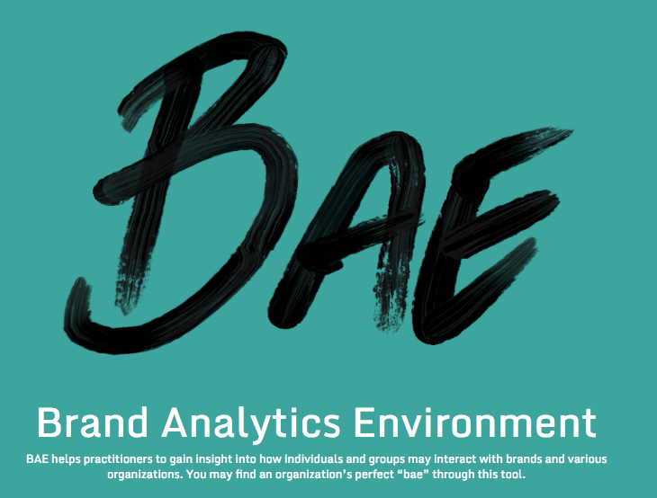
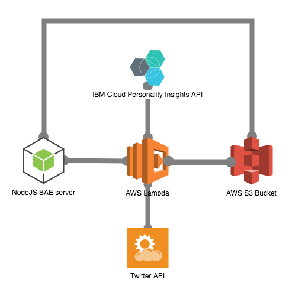

[](https://opensource.org/licenses/Apache-2.0) 

## BAE -- Brand Analytics Environment


### For users or potential users:
- Go to **[socialmediamacroscope.org](https://socialmediamacroscope.org)** and request for an account
- Contact us the **[SRTI lab](https://srtilab.techservices.illinois.edu/about/)** if you have any question: <a href="mailto:srti-lab@illinois.edu">srti-lab@illinois.edu</a>

### For developers:
#### Structure of BAE:


#### Prerequisite:
- You have **Nodejs** installed: https://nodejs.org/en/download
   * In the root directory of BAE, install required libraries ```npm install```
- You have **Python3** installed: https://www.python.org/download/releases/3.0/
   * Use pip3 or Aniconda to install required python libraries ```pip3 install boto3 scikit-learn numpy```
- Place a ```config.json``` file under the path ```root directory``` and another ```config.json``` file under path ```scripts/```
   * These two files contain credentials to acess **twitter**, **AWS**, and **mashape**.
   * content of config.json looks like this:
   > {
   >    "twitter":{
   >      "consumerKey":"************",
   >      "consumerSecret":"************"
   >    },
   >    "aws":{
   >      "accessKey":"************",
   >      "accessKeySecret":"************"
   >    },
   >    "mashape":{
   >      "apiKey":"************"
   >    }
   >  }
   * You have to set up **AWS** access to AWS lambda, and S3 bucket.
   
#### Configuration:
- Clone this repository to your local disk. ```git clone https://cwang138@opensource.ncsa.illinois.edu/bitbucket/scm/smm/smm-bae.git BAE``` 
- Test the BAE server ```npm test```
- Run the BAE server ```npm start```. BAE runs on port 8001: http://localhost:8001

#### Computation:
- The business logic is handled by this BAE server and meanwhile the computation part is deployed on AWS Lambda. 
You can find the deployed python code in [smm-analytics repository](https://opensource.ncsa.illinois.edu/bitbucket/projects/SMM/repos/smm-analytics/browse)
   * **bae_botometer/** contains script that checks if a twitter screen name is a bot or not
   * **bae_check_screen_name/** contains scripts that check if the input twitter screen names exist or not
   * **bae_collect_timeline/** crawl the most recent twitter status of a given screen name through Twitter's API
   * **bae_get_personality/** retreive IBM personality scores via IBM Cloud's API
   * **bae_get_sim_score/** calculates the cosine similarity score of two screen names' personality score
   * **bae_bulk_comparison/** compare multiple persons personality scores and calculates the consine similarity matrix
   
Please contact the **[SRTI lab](https://srtilab.techservices.illinois.edu/about/)** to request assistance on setting up the BAE server.
